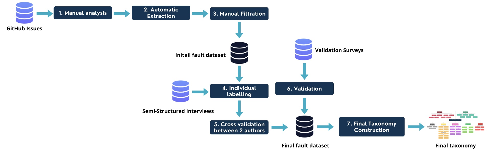
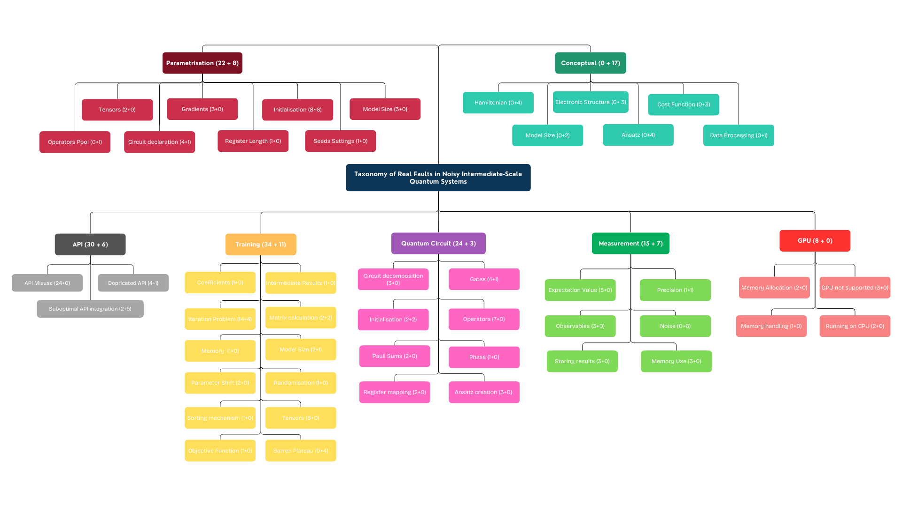

# A-Taxonomy-of-Real-Faults-in-Hybrid-Quantum-Classical-Architectures

*Abstract:* 
With the popularity of hybrid quantum-classical systems, particularly noisy intermediate-scale quantum (NISQ) architectures, comes the need for adapted quality assurance methods. In this study, we propose a taxonomy of NISQ faults accompanied by real faults in the identified categories. To achieve this, we empirically analysed open-source NISQ repositories for fixed faults. We analysed over 5000 closed issues on GitHub and pre-selected 529 of them based on rigorously defined inclusion criteria. We selected 133 faults that we labelled around symptoms and the origin of the faults. We cross-validated the classification and labels assigned to every fault between the two authors. As a result, we introduced a taxonomy of real faults in NISQ systems. Subsequently, we validated the taxonomy through interviews conducted with over eleven NISQ developers. The taxonomy was dynamically updated throughout the cross-validation and interview processes. The final version was validated and discussed through surveys conducted with a second batch of domain experts to ensure its relevance.

**Methodology**

- Datasets Folder contains the script used for Automatic extraction, as well as 3 files: the original extraction annotated by both authors, the initial dataset including the processed interview, and the final dataset organised around the categories used to build the final taxonomy.
- Interviews Folder contains the interview script as well as the original and polished transcriptions of all interviews. Interview parts that were extracted as faults for our dataset are highlighted in the polished versions.
- Survey Folder contains the survey form as well as the answers of the participants.

All interviews and surveys were anonymised.

**Final Taxonomy**

